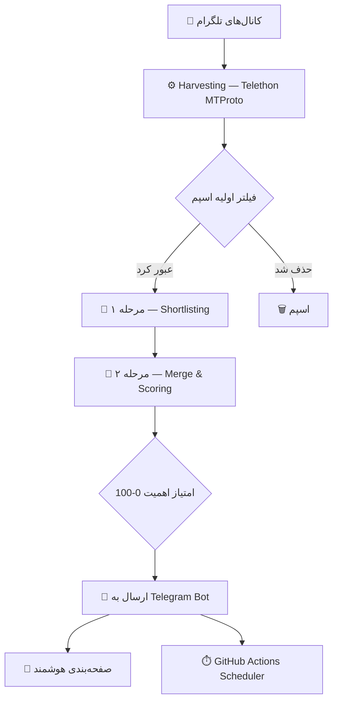

<div align="center">


<br/>


<br/>

<a href="https://www.python.org/"></a>
<a href="https://t.me/telebriefdata_bot"></a>
<a href="LICENSE"></a>
<a href="https://my.telegram.org"></a>
<a href="https://github.com/Amin-Moniry/TeleBrief"></a>

<br/><br/>

> **"در دنیایی که در سیل اطلاعات غرق شده، هنر واقعی در چیزی‌ست که نادیده می‌گیری."**


</div>

---

<div align="center">

## `◈` معرفی

</div>

<div align="center">

**TeleBrief** صدها کانال تلگرامی حوزه‌ی فناوری و امنیت شبکه را به‌صورت لحظه‌ای رصد می‌کند، اسپم و محتوای بی‌ارزش را حذف می‌کند و با یک پایپ‌لاین هوش مصنوعی دو مرحله‌ای، خروجی را به‌صورت گزارش‌های امتیازدهی‌شده، خلاصه‌شده و همراه با لینک منبع مستقیم در اختیار شما قرار می‌دهد.

هسته‌ی سیستم بر پایه‌ی اسکرپینگ عمیق با **Telethon (MTProto)** ساخته شده — بدون نیاز به دسترسی ادمین، بدون محدودیت نرخ، و با پایش لحظه‌ای. خروجی نهایی در قالب کارت‌های زیبا و فارسی‌نویس در تلگرام تحویل داده می‌شود.

</div>

<br/>


---

<div align="center">

## `◈` چرا TeleBrief؟


<small>

| <sub>▶ مسئله</sub> | <sub>واقعیت</sub> |
|:---:|:---:|
| <sub>حجم پست‌ها</sub> | <sub>هزاران پست در روز در کانال‌های فنی تلگرام</sub> |
| <sub>اسپم</sub> | <sub>۷۰٪ محتوای بی‌ارزش و تکراری</sub> |
| <sub>کلیک‌بیت</sub> | <sub>۲۰٪ عنوان‌های فریبنده بدون محتوای واقعی</sub> |
| <sub>ارزش واقعی</sub> | <sub>تنها ۱۰٪ قابل استفاده — و TeleBrief دقیقاً همان را پیدا می‌کند</sub> |

</small>

</div>

<br/>

<div align="center">

### سه رکن اصلی

<table>
<tr>
<td align="center" width="260">

**`◆` اسکرپینگ عمیق MTProto**
<sub>دسترسی بدون نیاز به ادمین · پایش لحظه‌ای · عبور از محدودیت نرخ</sub>

</td>
<td align="center" width="260">

**`◆` پایپ‌لاین دو مرحله‌ای AI**
<sub>مرحله ۱: فیلتر و حذف اسپم · مرحله ۲: ادغام و امتیازدهی اهمیت (۰ تا ۱۰۰)</sub>

</td>
<td align="center" width="260">

**`◆` رابط زیبای تلگرام**
<sub>کارت‌های فارسی‌نویس · جزئیات باز‌شونده · لینک مستقیم منبع</sub>

</td>
</tr>
</table>

</div>

<br/>


---

<div align="center">

## `◈` قابلیت‌های اصلی


<small>

| <sub>▶ ویژگی</sub> | <sub>توضیح</sub> | <sub>وضعیت</sub> |
|:---:|:---:|:---:|
| <sub>تحلیل دو‌لایه AI</sub> | <sub>مبتنی بر DeepSeek V3/V4 و OpenAI — استخراج اهمیت، استدلال و اثرات فنی</sub> | <sub>✅</sub> |
| <sub>داشبورد لود زنده</sub> | <sub>وضعیت متحرک لحظه‌ای با ردیابی هر فاز از پردازش</sub> | <sub>✅</sub> |
| <sub>فیلتر زمانی انعطاف‌پذیر</sub> | <sub>پیش‌تنظیم‌های ۶ تا ۷۲۰ ساعته + بازه‌ی سفارشی</sub> | <sub>✅</sub> |
| <sub>شخصی‌سازی کانال‌ها</sub> | <sub>شروع با لیست پیش‌فرض + افزودن کانال نامحدود</sub> | <sub>✅</sub> |
| <sub>صفحه‌بندی هوشمند</sub> | <sub>۱۰ آیتم در هر صفحه بر اساس اهمیت، بارگذاری تدریجی</sub> | <sub>✅</sub> |
| <sub>تاب‌آوری هوشمند</sub> | <sub>در صورت خطای LLM، بازگشت به رتبه‌بندی تعاملی — هرگز تحلیل جعلی</sub> | <sub>✅</sub> |
| <sub>نرخ دلار و طلا</sub> | <sub>تازه‌ترین قیمت دلار و طلای ۱۸ عیار از چند کانال ارز، همیشه جدیدترین بروزرسانی بر اساس زمان واقعی پیام</sub> | <sub>✅</sub> |
| <sub>پشتیبانی مدیا</sub> | <sub>تصویر، فایل و پیام صوتی</sub> | <sub>⏳</sub> |
| <sub>داشبورد آنالیتیکس</sub> | <sub>متریک‌های استفاده و پایش عملکرد</sub> | <sub>⏳</sub> |

</small>

</div>

<br/>


---

<div align="center">

## `◈` معماری سیستم


</div>



<br/>

<div align="center">

### `◆` عملکرد

<small>

| <sub>متریک</sub> | <sub>مقدار</sub> |
|:---:|:---:|
| <sub>زمان تحلیل</sub> | <sub>۱۵ تا ۴۵ ثانیه</sub> |
| <sub>سرعت اسکن</sub> | <sub>~۱۰۰ پیام در ثانیه</sub> |
| <sub>مصرف حافظه</sub> | <sub>کمتر از ۱۵۰MB</sub> |
| <sub>سرعت صفحه‌بندی</sub> | <sub>کمتر از ۱ ثانیه</sub> |

</small>

</div>

<br/>


---

<div align="center">

## `◈` نصب و راه‌اندازی


</div>

**پیش‌نیازها:** Python 3.11+ · حساب تلگرام · Telegram API ID/Hash از my.telegram.org · توکن ربات از BotFather@ · کلید API برای LLM

 &nbsp; کلون کردن ریپو و ساخت محیط مجازی

```bash
git clone https://github.com/Amin-Moniry/TeleBrief.git
cd TeleBrief

python -m venv venv
source venv/bin/activate   # Linux/Mac
# venv\Scripts\activate    # Windows
```

 &nbsp; نصب وابستگی‌ها

```bash
pip install -r requirements.txt
```

 &nbsp; ساخت Session String تلگرام

```bash
python -c "
from telethon.sync import TelegramClient
from telethon.sessions import StringSession
API_ID = YOUR_API_ID
API_HASH = 'YOUR_API_HASH'
with TelegramClient(StringSession(), API_ID, API_HASH) as c:
    print(c.session.save())
"
```

 &nbsp; تنظیم متغیرهای محیطی

```bash
cp .env.example .env
# ویرایش .env با مقادیر خودتان
```

 &nbsp; اجرا

```bash
python command_bot.py
```

<br/>


---

<div align="center">

## `◈` استقرار (Deployment)

</div>

<table align="center">
<tr>
<td align="center" width="230">

**`◆` Railway / Render / Fly.io**
<sub>رایگان و ۲۴/۷ — اتصال ریپو، تنظیم Start Command، افزودن Env Vars، دیپلوی</sub>

</td>
<td align="center" width="230">

**`◆` GitHub Actions**
<sub>ساخت `.github/workflows/daily.yml` برای گزارش‌های زمان‌بندی‌شده ۱۲ ساعته</sub>

</td>
<td align="center" width="230">

**`◆` Docker**
```bash
docker run -d --name telebrief \
  --env-file .env telebrief:latest
```

</td>
</tr>
</table>

<br/>


---

<div align="center">

## `◈` پشته فناوری

| Layer | Technology |
|:-----:|:----------:|
| **زبان** | Python 3.11+ |
| **کلاینت تلگرام** | Telethon (MTProto) |
| **فریم‌ورک بات** | python-telegram-bot |
| **دروازه LLM** | xKiro (سازگار با OpenAI) |
| **ذخیره‌سازی** | JSON |
| **همزمانی** | asyncio |
| **CI/CD** | GitHub Actions |

</div>

<br/>


---

<div align="center">

## `◈` تنظیمات محیطی

</div>

```bash
API_ID=YOUR_ID
API_HASH=YOUR_HASH
SESSION_STRING=YOUR_SESSION
BOT_TOKEN=YOUR_TOKEN
XKIRO_API_KEY=YOUR_KEY
API_BASE_URL=https://api.xkiro.com/v1
DEFAULT_MODEL=openai/gpt-5.6-luna
FALLBACK_MODELS=z-ai/glm-5.3-flash
HOURS_WINDOW=12
BATCH_CHAR_LIMIT=12000
MODEL_RETRIES=4
ANALYSIS_CONCURRENCY=1
CURRENCY_HOURS_WINDOW=6
```

```python
DEFAULT_MODEL = "openai/gpt-5.6-luna"     # سریع و ارزان
FALLBACK_MODELS = "z-ai/glm-5.3-flash"    # استدلال بهتر
```

<br/>


---

<div align="center">

## `◈` رفع اشکال


</div>

**بات اجرا نمی‌شود**
```bash
ps aux | grep command_bot.py
kill -9 PID
# دریافت توکن جدید از BotFather@
```

**خطای 503 سرویس LLM**
```bash
curl https://api.xkiro.com/v1/models
# سوییچ مدل
DEFAULT_MODEL=openai/gpt-5.6-luna
```

**Session منقضی شده**
```
اسکریپت SESSION_STRING بالا را دوباره اجرا کنید
```

**محدودیت نرخ**
```
ANALYSIS_CONCURRENCY=1 را کاهش دهید یا BATCH_CHAR_LIMIT=20000 را افزایش دهید
```

<br/>


---

<div align="center">

## `◈` سوالات متداول

<small>

| <sub>سوال</sub> | <sub>پاسخ</sub> |
|:---|:---|
| <sub>**دقت تحلیل چقدر است؟**</sub> | <sub>۸۰ تا ۹۰٪ در امتیازدهی اهمیت، آموزش‌دیده روی الگوهای فناوری/امنیت</sub> |
| <sub>**می‌شود LLM خودمیزبان استفاده کرد؟**</sub> | <sub>بله — هر API سازگار با OpenAI (Ollama، LocalAI و...)</sub> |
| <sub>**حریم خصوصی چطور است؟**</sub> | <sub>تحلیل محلی، بدون لاگ، مطابق با ToS ارائه‌دهنده API</sub> |
| <sub>**افزودن کانال دلخواه؟**</sub> | <sub>با دستور `/addchannel` و وارد کردن `@channel_name`</sub> |
| <sub>**چرا کند است؟**</sub> | <sub>بچ بزرگ یا LLM کند — `ANALYSIS_CONCURRENCY` را افزایش دهید</sub> |

</small>

</div>

<br/>


---

<div align="center">

## `◈` کانال‌های پیش‌فرض

<table>
<tr>
<td align="center" width="330">

**🧠 کانال‌های AI**
<sub>@RoidBest · @Farda_Ai · @Lumosel · @asrnovin_ir · @perplexity · @cryptoquant_official · @Hugging_face_news · @arzdigitalb · @Artificial_intelligence_in · @DeepLearning_ai · @HomeAI · @Artificial_Intelligence_AI · @data_science_info</sub>

</td>
<td align="center" width="330">

**🛡️ کانال‌های امنیتی**
<sub>@cybersecurityexperts · @thehackernews · @cibsecurity · @Cyber_Security_Channel · @androidMalware · @cloudandcybersecurity · @itsecalert · @intsec · @topcybersecurity</sub>

</td>
</tr>
</table>

**افزودن کانال نامحدود از طریق منوی بات**

</div>

<br/>


---

<div align="center">

## `◈` دستورات بات

```
/start          → راه‌اندازی، نمایش منوی اصلی
/menu           → انتخاب سریع دسته‌بندی
/ai             → خلاصه ۱۲ ساعت اخیر حوزه AI
/security       → خلاصه ۱۲ ساعت اخیر حوزه امنیت
/price          → نرخ لحظه‌ای دلار و طلای ۱۸ عیار
/help           → راهنمای استفاده
/about          → درباره پروژه
```

</div>

<br/>


---

<div align="center">

## `◈` مشارکت (Contributing)

1. Fork کردن ریپو
2. ساخت برنچ: `git checkout -b feature/your-idea`
3. کامیت: `git commit -m 'feat: description'`
4. پوش: `git push origin feature/your-idea`
5. باز کردن Pull Request

</div>

<br/>


---

<div align="center">

## `◈` سازنده

<br/>


<br/>

<table>
<tr>
<td align="center" width="210">
<a href="https://github.com/Amin-Moniry">

</a>
</td>
<td align="center" width="210">
<a href="https://t.me/telebriefdata_bot">

</a>
</td>
<td align="center" width="210">
<a href="https://github.com/Amin-Moniry/TeleBrief/issues">

</a>
</td>
</tr>
</table>

⭐ **اگر این پروژه به دردتان خورد، یک ستاره بدهید!**

</div>

<br/>


---

<div align="center">

## `◈` لایسنس

پروژه تحت مجوز **MIT License** منتشر شده — جزئیات کامل در فایل [LICENSE](LICENSE)

<br/>


<br/>


</div>cc