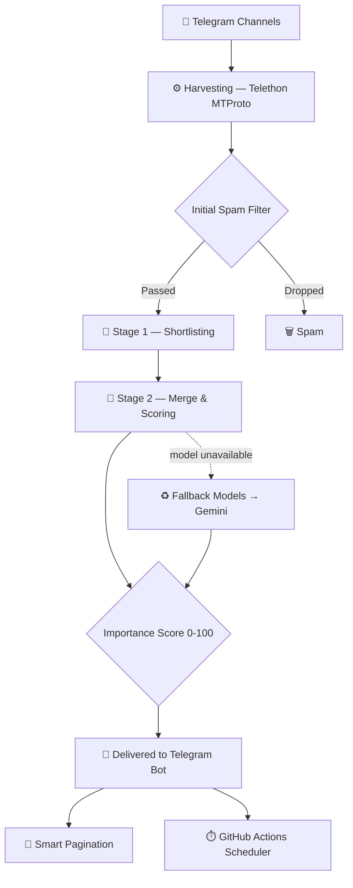

<div align="center">


<br/>


<br/>

<a href="https://www.python.org/"></a>
<a href="https://t.me/telebriefdata_bot"></a>
<a href="LICENSE"></a>
<a href="https://my.telegram.org"></a>
<a href="https://github.com/Amin-Moniry/TeleBrief"></a>

<br/><br/>

> **"In a world drowning in information, the real art lies in what you choose to ignore."**


</div>

---

<div align="center">

## `◈` Overview

</div>

<div align="center">

**TeleBrief** monitors hundreds of Telegram channels covering technology, cybersecurity, the USD/gold market, crypto, and geopolitical conflict in real time. It strips out spam and low-value noise, then runs everything through a **two-stage AI pipeline** that returns scored, summarized reports with direct source links — delivered straight into a Telegram bot.

The scraping core runs on deep **Telethon (MTProto)** access — no admin rights required, no aggressive rate limits, and always live. Every report is rendered as a clean, structured card right inside Telegram, and each user can shape their own feed with custom channels, time windows, and categories.

</div>

<br/>


---

<div align="center">

## `◈` Why TeleBrief?


<small>

| <sub>▶ Problem</sub> | <sub>Reality</sub> |
|:---:|:---:|
| <sub>Post volume</sub> | <sub>Thousands of posts a day across technical Telegram channels</sub> |
| <sub>Spam</sub> | <sub>~70% is low-value or repetitive noise</sub> |
| <sub>Clickbait</sub> | <sub>~20% is misleading headlines with no real substance</sub> |
| <sub>Actual signal</sub> | <sub>Only ~10% is worth reading — and that's exactly what TeleBrief surfaces</sub> |

</small>

</div>

<br/>

<div align="center">

### Three Pillars

<table>
<tr>
<td align="center" width="260">

**`◆` Deep MTProto Scraping**
<sub>No admin access needed · live monitoring · sidesteps aggressive rate limits</sub>

</td>
<td align="center" width="260">

**`◆` Two-Stage AI Pipeline**
<sub>Stage 1: shortlist & spam filtering · Stage 2: merge & importance scoring (0–100)</sub>

</td>
<td align="center" width="260">

**`◆` Self-Serve Telegram UI**
<sub>Structured cards · expandable detail · direct source links · per-user customization</sub>

</td>
</tr>
</table>

</div>

<br/>


---

<div align="center">

## `◈` Key Features


<small>

| <sub>▶ Feature</sub> | <sub>Description</sub> | <sub>Status</sub> |
|:---:|:---:|:---:|
| <sub>Two-layer AI analysis</sub> | <sub>Powered by DeepSeek V4 / OpenAI-compatible models with automatic fallback — extracts importance, reasoning, and technical impact</sub> | <sub>✅</sub> |
| <sub>Resilient model chain</sub> | <sub>Primary model → configurable text-model fallbacks → Gemini as a last resort, with retry limits at every hop — a report is never faked</sub> | <sub>✅</sub> |
| <sub>Live loading dashboard</sub> | <sub>Animated, stage-by-stage progress card while a report is generated, with an inline cancel button</sub> | <sub>✅</sub> |
| <sub>Background, cancellable reports</sub> | <sub>Report generation runs as a background task per user, so a "cancel report" tap is honored instantly instead of queuing behind it</sub> | <sub>✅</sub> |
| <sub>Flexible time filters</sub> | <sub>Preset windows from 6 to 720 hours, plus a fully custom hour range</sub> | <sub>✅</sub> |
| <sub>Per-user custom channels</sub> | <sub>Starts from a curated default list, then add or remove unlimited personal channels via `/addchannel`</sub> | <sub>✅</sub> |
| <sub>Smart pagination</sub> | <sub>10 items per page, ranked by importance, with a "load more" button for the rest</sub> | <sub>✅</sub> |
| <sub>Mandatory-join gate</sub> | <sub>Optional membership check against a required channel before granting access, fail-safe by design</sub> | <sub>✅</sub> |
| <sub>Admin analytics (`/stats`)</sub> | <sub>Silent, admin-only command showing total users, daily growth, requests by category, and a paginated leaderboard</sub> | <sub>✅</sub> |
| <sub>USD & gold rates</sub> | <sub>Latest USD and 18k gold prices pulled from multiple currency channels, always resolved to the freshest real-world timestamp</sub> | <sub>✅</sub> |
| <sub>Crypto & geopolitical market report</sub> | <sub>A narrative overview of crypto market conditions and war/geopolitical risk, plus sourced highlights with 10-item pagination</sub> | <sub>✅</sub> |
| <sub>Atomic state persistence</sub> | <sub>User state (preferences, stats, channels) is written atomically to disk to survive concurrent writes and crashes</sub> | <sub>✅</sub> |
| <sub>Media support</sub> | <sub>Images, files, and voice messages</sub> | <sub>⏳</sub> |
| <sub>Full analytics dashboard</sub> | <sub>Usage metrics and performance monitoring UI</sub> | <sub>⏳</sub> |

</small>

</div>

<br/>


---

<div align="center">

## `◈` System Architecture


</div>



<br/>

<div align="center">

### `◆` Performance

<small>

| <sub>Metric</sub> | <sub>Value</sub> |
|:---:|:---:|
| <sub>Analysis time</sub> | <sub>15–45 seconds</sub> |
| <sub>Scan throughput</sub> | <sub>~100 messages/sec</sub> |
| <sub>Memory footprint</sub> | <sub>Under 150 MB</sub> |
| <sub>Pagination latency</sub> | <sub>Under 1 second</sub> |

</small>

</div>

<br/>


---

<div align="center">

## `◈` Installation & Setup


</div>

**Prerequisites:** Python 3.11+ · a Telegram account · Telegram API ID/Hash from my.telegram.org · a bot token from @BotFather · an API key for the LLM gateway

 &nbsp; Clone the repo and create a virtual environment

```bash
git clone https://github.com/Amin-Moniry/TeleBrief.git
cd TeleBrief

python -m venv venv
source venv/bin/activate   # Linux/Mac
# venv\Scripts\activate    # Windows
```

 &nbsp; Install dependencies

```bash
pip install -r requirements.txt
```

 &nbsp; Generate a Telegram session string

```bash
python -c "
from telethon.sync import TelegramClient
from telethon.sessions import StringSession
API_ID = YOUR_API_ID
API_HASH = 'YOUR_API_HASH'
with TelegramClient(StringSession(), API_ID, API_HASH) as c:
    print(c.session.save())
"
```

 &nbsp; Set your environment variables

```bash
cp .env.example .env
# edit .env with your own values
```

 &nbsp; Run it

```bash
python command_bot.py
```

<br/>


---

<div align="center">

## `◈` Deployment

</div>

<table align="center">
<tr>
<td align="center" width="230">

**`◆` Railway / Render / Fly.io**
<sub>Free & 24/7 — connect the repo, set the start command, add env vars, deploy</sub>

</td>
<td align="center" width="230">

**`◆` GitHub Actions**
<sub>Add `.github/workflows/daily.yml` for scheduled reports every 12 hours</sub>

</td>
<td align="center" width="230">

**`◆` Docker**
```bash
docker run -d --name telebrief \
  --env-file .env telebrief:latest
```

</td>
</tr>
</table>

<br/>


---

<div align="center">

## `◈` Tech Stack

| Layer | Technology |
|:-----:|:----------:|
| **Language** | Python 3.11+ |
| **Telegram client** | Telethon (MTProto) |
| **Bot framework** | python-telegram-bot |
| **LLM gateway** | xKiro (OpenAI-compatible) with Gemini fallback |
| **Concurrency** | asyncio with a bounded fetch semaphore |
| **Persistence** | JSON, written atomically |
| **CI/CD** | GitHub Actions |

</div>

<br/>


---

<div align="center">

## `◈` Environment Configuration

</div>

```bash
API_ID=YOUR_ID
API_HASH=YOUR_HASH
SESSION_STRING=YOUR_SESSION
BOT_TOKEN=YOUR_TOKEN
XKIRO_API_KEY=YOUR_KEY
API_BASE_URL=https://api.xkiro.com/v1
DEFAULT_MODEL=deepseek/deepseek-v4-pro
FALLBACK_MODELS=mistralai/mistral-medium-3.5
GEMINI_API_KEY=YOUR_GEMINI_KEY
GEMINI_MODEL=gemini-2.5-flash
ADMIN_ID=YOUR_TELEGRAM_NUMERIC_ID
HOURS_WINDOW=24
CURRENCY_HOURS_WINDOW=6
BATCH_CHAR_LIMIT=12000
MODEL_RETRIES=3
ANALYSIS_CONCURRENCY=1
MAX_CONCURRENT_FETCHES=1
```

```python
DEFAULT_MODEL   = "deepseek/deepseek-v4-pro"        # primary reasoning model
FALLBACK_MODELS = "mistralai/mistral-medium-3.5"    # comma-separated fallback chain
GEMINI_MODEL    = "gemini-2.5-flash"                # last-resort fallback
```

<sub>`ADMIN_ID` is the only account with access to `/stats`; the command stays silent for everyone else so it doesn't reveal itself.</sub>

<br/>


---

<div align="center">

## `◈` Troubleshooting


</div>

**Bot doesn't start**
```bash
ps aux | grep command_bot.py
kill -9 PID
# grab a fresh token from @BotFather
```

**LLM gateway returns a 503**
```bash
curl https://api.xkiro.com/v1/models
# switch models
DEFAULT_MODEL=deepseek/deepseek-v4-pro
```

**Session expired**
```
Re-run the SESSION_STRING script above
```

**Rate limited**
```
Lower ANALYSIS_CONCURRENCY / MAX_CONCURRENT_FETCHES, or raise BATCH_CHAR_LIMIT=20000
```

<br/>


---

<div align="center">

## `◈` FAQ

<small>

| <sub>Question</sub> | <sub>Answer</sub> |
|:---|:---|
| <sub>**How accurate is the analysis?**</sub> | <sub>80–90% on importance scoring, tuned on tech/security patterns</sub> |
| <sub>**Can I use a self-hosted LLM?**</sub> | <sub>Yes — any OpenAI-compatible API (Ollama, LocalAI, etc.)</sub> |
| <sub>**What happens if the primary model fails?**</sub> | <sub>It automatically retries, then falls through the configured fallback models, then Gemini — never a fabricated report</sub> |
| <sub>**How's privacy handled?**</sub> | <sub>Local analysis, no persistent logs, subject to your chosen API provider's ToS</sub> |
| <sub>**Can I add my own channel?**</sub> | <sub>Yes — use `/addchannel` and send `@channel_name`</sub> |
| <sub>**Why is it slow sometimes?**</sub> | <sub>Large batch size or a slow LLM response — try raising `ANALYSIS_CONCURRENCY`</sub> |

</small>

</div>

<br/>


---

<div align="center">

## `◈` Default Channels

<table>
<tr>
<td align="center" width="330">

**🧠 AI Channels**
<sub>@RoidBest · @Farda_Ai · @Lumosel · @asrnovin_ir · @perplexity · @cryptoquant_official · @hiaimediaen · @Hugging_face_news · @samiotech · @arzdigitalb · @Artificial_intelligence_in · @DeepLearning_ai · @HomeAI · @Artificial_Intelligence_AI · @data_science_info</sub>

</td>
<td align="center" width="330">

**🛡️ Security Channels**
<sub>@cybersecurityexperts · @thehackernews · @cibsecurity · @Cyber_Security_Channel · @androidMalware · @cloudandcybersecurity · @itsecalert · @intsec · @topcybersecurity</sub>

</td>
</tr>
<tr>
<td align="center" width="330">

**🪙 Crypto & War Channels**
<sub>@eco_ehsan · @Nobitexmag · @mihanblockchain · @helperhash · @whale_alert_io · @CoinDeskGlobal · @tokenbaz_com · @asiasarmayeh</sub>

</td>
<td align="center" width="330">

**💵 USD & Gold Channels**
<sub>@irancurrency · @TetherLand · @navasanchannel</sub>

</td>
</tr>
</table>

**Add unlimited personal channels straight from the bot menu**

</div>

<br/>


---

<div align="center">

## `◈` Bot Commands

```
/start          → boot up and show the main menu
/menu           → quick category picker
/ai             → latest AI digest
/security       → latest cybersecurity digest
/crypto         → crypto market & geopolitical risk report
/addchannel     → add a personal channel to your feed
/price          → live USD & 18k gold rates
/help           → usage guide
/about          → about TeleBrief
/stats          → admin-only usage analytics
```

</div>

<br/>


---

<div align="center">

## `◈` Contributing

1. Fork the repo
2. Create a branch: `git checkout -b feature/your-idea`
3. Commit: `git commit -m 'feat: description'`
4. Push: `git push origin feature/your-idea`
5. Open a Pull Request

</div>

<br/>


---

<div align="center">

## `◈` Creator

<br/>


<br/>

<table>
<tr>
<td align="center" width="210">
<a href="https://github.com/Amin-Moniry">

</a>
</td>
<td align="center" width="210">
<a href="https://t.me/telebriefdata_bot">

</a>
</td>
<td align="center" width="210">
<a href="https://github.com/Amin-Moniry/TeleBrief/issues">

</a>
</td>
</tr>
</table>

⭐ **If this project is useful to you, drop a star!**

</div>

<br/>


---

<div align="center">

## `◈` License

Released under the **MIT License** — full details in [LICENSE](LICENSE)

<br/>


<br/>


</div>